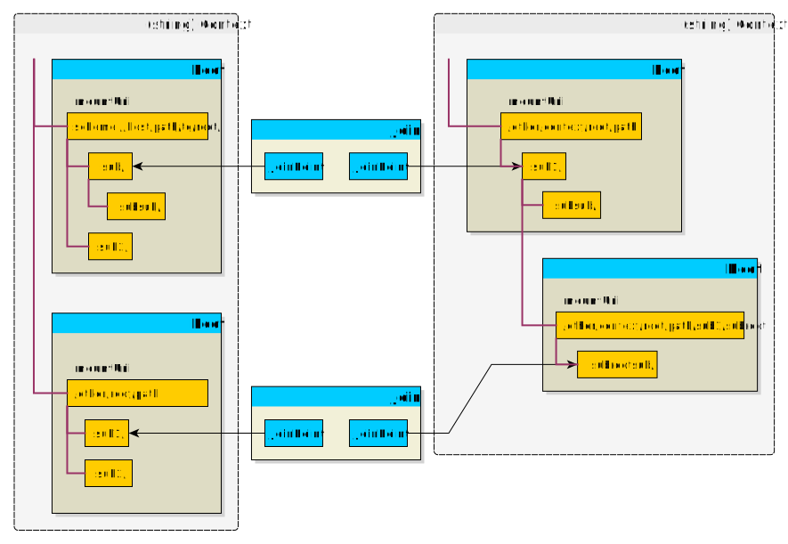
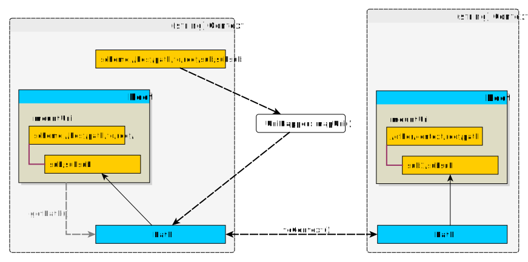

# exteon/uri-mapper

A framework library for mapping hierarchical URI systems.

## Abstract

Many times, systems must operate with multiple "path" representations of a
resource. For instance:

* in a file web server, local file paths correspond to public web URIs;
* in a Content Management System, HTML content links are usually persisted using
  an internal URI space that gets translated to public web URIs at runtime
* Applications might need to address local files using a virtual filesystem
  abstraction layer:
    * File content might be stored in a local filesystem mapped CDN, but need to
      be publicly addressed on the web using an URL scheme specific to the CDN
    * Load balancing: mapping session files to different tempfs mounts (shards)
      based on prefix or hash
    * Migrating session files: a dynamic mapping could be set up to map a
      session file to one mount point or another depending on the progress of a
      background migration process

These are all cross-cutting infrastructure concerns that are never part of the
business domain for any application, so they should not pollute the application
domain logic. `UriMapper` provides an abstraction to externalize any resource
mapping concern; the core app needs only know it's dealing with resources
identified by paths and each resource can have different paths in different
contexts, but can make abstraction of the process by which a resource gets
mapped to a path in a specific context.

## Notions

The generic way to represent resource paths in `UriMapper` are URIs, because of
both their ubiquitous use in identifying resources and their versatility (i.e.
local filesystem paths are represented as URIs that only have the path
component, but no scheme, authority, query or fragment components).

URIs are treated as hierarchical paths (i.e. `scheme://host/a/b/` is a
descendant of `scheme://host/a/`), generating a tree-like space of
representation for URIs.

The URIs can span multiple spaces, called **Contexts**. I.e. a resource might
have a local file path in a `'file'` context, and a web URL in a `'web'`
context. Contexts are modeled as string identifiers.

## Structure

In the diagram below, a mapping setup with 2 contexts is illustrated; in the
rightmost context, a nested root mapping is illustrated, where a `Root` is
mounted on a descendant URI of another.

Yellow boxes represent `Uri` types and the purple treelines indicate
hierarchical path descendency.



The entities modeling the mapper are:

### `Uri`

Can be generic Uris or special-format Uris. One trait they share is they are
interpreted in a hierarchical path context. The path component of an URI is
treated as a `/` - delimited hierarchical path. Uris are used in input as
address points in the mapping space, or output as part of a `Path`. To learn 
more about the underlying implementation of URIs, please refer to the
[exteon/uri](https://github.com/exteon/uri) component, which is used for URI
representation.

### `Root`

A `Root` is a "mount point" in the virtual URI system. A `Root` is mounted at
an `Uri` base in a context and its main concern is creating `Path`s for
hierarchical addresses under its mount point `Uri`.

### `Path`

A `Path` is generically a touple of (`Root`, `Uri`) and it models a path
corresponding to the `Uri` under its `Root`. Special `Path` implementations may
provide more functionality than just accessing their `Uri`; for instance,
`FilePath` uses a `UnixPathUri` for its `Uri` and provides basic local file
manipulation functions for the local path.

### `Context`

`Context`s are `Root`/`Path` spaces designated by a string identifier (`name`).
The same resource might be represented by different `Uri`s / `Path`s in
different contexts. For example, assuming the file web server case described in
[Abstract](#abstract) above, we might have a `'file'` context containing local
file paths and a `'web'` context corresponding public web URIs for the same file
paths.

### `Join`

A `Join` is a translation mechanism for converting `Path`s (and consequentially
`Uri`s) from one context to another. A join contains any number of `JoinPoint`s
in any number of contexts, and implements a translation mechanism for
translating `Path`s under `JoinPoint`s between their corresponding contexts.

### `JoinPoint`

Much like a `Root`, a `JoinPoint` represents a base `Uri` in context; the
relative paths under it can be translated to another context by the
`Join` that the `JoinPoint` is attached to.

## Mapping

The basic mapping flows are illustrated below. An `Uri` can be converted to a
`Path` via `UriMapper::mapUri()`. Paths can be mapped across context via their
`toContext()` method.



## Usage

### Use case 1: File web server

Let's assume a file web server serves local files under `/var/www/html` under a
publid web uri of `http://foo.bar/public/`; the following PHP script receives
a `$uriString` that contains the public web uri and needs to serve the
corresponding local file:

```php

// Setup

use Exteon\Uri\UnixPathUri;
use Exteon\Uri\Uri;
use Exteon\UriMapper\FilePath;
use Exteon\UriMapper\FileRoot;
use Exteon\UriMapper\Join;
use Exteon\UriMapper\JoinPoint;
use Exteon\UriMapper\Root;
use Exteon\UriMapper\UriMapper;

$uriMapper = new UriMapper();

$fileRootUri = UnixPathUri::fromString('/var/www/html');
$webRootUri = Uri::fromString('http://foo.bar/public/');

$uriMapper
    ->addRoot(
        new FileRoot($uriMapper, $fileRootUri, 'file'),
        new Root($uriMapper, $webRootUri, 'web')
    )
    ->addJoin(
        new Join(
            $uriMapper,
            [
                new JoinPoint($uriMapper, $fileRootUri,'file'),
                new JoinPoint($uriMapper, $webRootUri,'web')
            ]
        )
    );

// Process

// we receive requested URI in $uriString, eg.
$uriString = 'http://foo.bar/public/some/file.txt';

// discard URI querystring and fragment
$requestUri = 
    Uri::fromString($uriString)
        ->setQueryString(null)
        ->setFragment(null);

// Get web context path and convert to file context
$webPath = $uriMapper->mapUri($requestUri, 'web');
$filePath = FilePath::type($webPath->toContext('file'));

//      Serve

if(!$filePath){
    http_response_code(400);
}
elseif(!$filePath->isFile()){
    http_response_code(404);
} else {
    header('Content-type: text/text');
    readfile($filePath->getUnixPath());
}
```

### Use case 2: virtual filesystem

Let's assume our app uses temporary files (i.e. for session management), but the
temporary files location can be changed by configuration (i.e. a ramfs mount
point in the filesystem) and that the app needs a transparent mechanism for
accessing the temp files.

```php
// Setup

use Exteon\Uri\UnixPathUri;
use Exteon\UriMapper\FilePath;
use Exteon\UriMapper\FileRoot;
use Exteon\UriMapper\Join;
use Exteon\UriMapper\JoinPoint;
use Exteon\UriMapper\UriMapper;

$uriMapper = new UriMapper();

$virtualTempUri = UnixPathUri::fromString('/tmp/');
$fileSystemTempUri = UnixPathUri::fromString('/mnt/ramfs1/tmp/');

$uriMapper
    ->addRoot(
        new FileRoot($uriMapper, $virtualTempUri, 'virtual'),
        new FileRoot($uriMapper, $fileSystemTempUri, 'file')
    )
    ->addJoin(
        new Join(
            $uriMapper,
            [
                new JoinPoint($uriMapper, $virtualTempUri,'virtual'),
                new JoinPoint($uriMapper, $fileSystemTempUri,'file')
            ]
        )
    );

// Generate session virtual path

$sessionId = 'ABCD';
$sessionFName = $sessionId.'.json';
$sessionVirtualPath = 
    $uriMapper->mapUri(
        UnixPathUri::fromString('/tmp'),
        'virtual'
    )->descend($sessionFName);

// Access actual file contents

$sessionFilePath = FilePath::type($sessionVirtualPath->toContext('file')); 
$sessionData = json_decode(file_get_contents($sessionFilePath->getUnixPath()));
```

This way, the main app can always address resources using an uniform virtual
filespace (eg. `/tmp/...`), and delegate the complexities of mapping to an
actual filepath to `UriMapper`, which can be set up with any complex mapping
scheme, such as mentioned in [Abstract](#abstract): load balancing, background
migrations of files, etc.

## Reference

### `UriMapper`

```php
public function addRoot(Root ...$roots): self
```

```php
public function addJoin(Join ...$joins): self
```

Register roots and joins with the `UriMapper`.

```php
public function mapUri(AbstractUri $uri, string $context = '' ): ?Path
```

Builds a `Path` for a certain URI in a specified context (or default "null"
context).

### `Root`

```php
public function __construct(
    UriMapper $uriMapper, 
    AbstractUri $mountUri, 
    string $context = '', 
    bool $doesAllowSubroots = true
)
```
<table>
    <tr>
        <td><code>
            $uriMapper
        </code></td>
        <td>
            Every <code>Root</code> must be assigned to a 
            <code>UriMapper</code>, and can't be shared between mappers.
        </td>
    </tr>
    <tr>
        <td><code>
            $mountUri
        </code></td>
        <td>
            <p>The base URI in the context space where the <code>Root</code> is 
            mounted. The mount URI <em>MUST</em> be an absolute URI (i.e. 
            having a scheme or authority fragment or a leading <code>/</code> in 
            the path fragment.</p>
            <p><b>Note</b><br>
            If the URI has a trailing slash, it designates a directory-type 
            mount point, where all descendant paths are considered to belong to 
            the <code>Root</code>. If the trailing slash is ommitted, it's a
            document-type mountpoint, where the <code>Root</code> mounts just 
            the exact URI.
            </p>
        </td>
    </tr>
    <tr>
        <td><code>
            $context
        </code></td>
        <td>
            The root's context
        </td>
    </tr>
    <tr>
        <td><code>
            $doesAllowSubRoots
        </code></td>
        <td>
            <p>Specifies whether other <code>Root</code>s can be mounted on 
            descendant paths of the current <code>Root</code>.</p>
            <p>Setting this to <code>false</code> triggers important performance 
            optimisations with regard to <code>Path::descend()</code>, since a 
            new root lookup doesn't need to be performed for descending 
            paths.</p>
            <p>This should be also set to <code>false</code> if, after mapping 
            through <code>UriMapper</code> the logic in your code uses its own 
            path descending mechanism (such as just appending 
            a <code>'/sub/path'</code> string to the mapped path: since that
            would not be using <code>Path::descend()</code> an inconsistence
            would occur between the two path spaces.</p>
        </td>
    </tr>
</table>

### `FileRoot`

Is a specialized type of `Root` that will generate `FilePath`s for descendant 
URIs. It `mountUri` must be of type `UnixPathUri`.

### `JoinPoint`

```php
public function __construct(
    UriMapper $uriMapper,
    AbstractUri $uri,
    string $context = '',
    int $type = self::TYPE_BOTH
)
```

<table>
    <tr>
        <td><code>
            $uriMapper
        </code></td>
        <td>
            Every <code>Root</code> must be assigned to a 
            <code>UriMapper</code>, and can't be shared between mappers.
        </td>
    </tr>
    <tr>
        <td><code>
            $mountUri
        </code></td>
        <td>
            <p>The base URI in the context space where the <code>Join</code> is 
            mounted. The join point URI <em>MUST</em> be an absolute URI (i.e. 
            having a scheme or authority fragment or a leading <code>/</code> in 
            the path fragment.</p>
            <p><b>Note</b><br>
            If the URI has a trailing slash, it designates a directory-type 
            mount point, where all descendant paths are considered to belong to 
            the <code>JoinPoint</code>. If the trailing slash is ommitted, it's 
            a document-type joinpoint, where the <code>Join</code> maps just 
            the exact URI.
            </p>
        </td>
    </tr>
    <tr>
        <td><code>
            $context
        </code></td>
        <td>
            The join point's context
        </td>
    </tr>
    <tr>
        <td><code>
            $type
        </code></td>
        <td>
            <p>Specifies the direction that the <code>JoinPoint</code> can be used
            for mapping. Possible values are 
            <code>JoinPoint::TYPE_SOURCE</code>, 
            <code>JoinPoint::TYPE_DESTINATION</code>,
            <code>JoinPoint::TYPE_BOTH</code>. The default 
            <code>TYPE_BOTH</code> signifies that the <code>JoinPoint</code> 
            acts bidirectionally: in a <code>Join</code>, it can take an URI in 
            its context and map it to the other <code>JoinPoint</code>s' 
            contexts, or conversely it can map URIs from the other 
            <code>JoinPoint</code>s contexts to its own context.</p>
            <p>Reasons to use unidirectional join points are if URIs in a 
            context can be converted only unidirectionally to another context, 
            or when a mapping would be ambiguous, such as when multiple source 
            context URIs are mapped to the same destination URI. In this case, 
            for performing reverse mapping, only one of the source join point 
            should have the canonical URI in that context and be 
            <code>TYPE_BOTH</code>; the other join points should be 
            <code>TYPE_SOURCE</code>.</p>
        </td>
    </tr>
</table>

### `Join`

```php
public function __construct(UriMapper $uriMapper, array $joinPoints)
```

Collection of `JoinPoint`s that map the same resource across different contexts.

### `Path`

Represents an `Uri` in a context, as the touple of a `Root` and a relative path 
to that `Root`'s mountpoint. Specialized `Path` types might implement more 
functionality related to that path. Specialized `Path` type are generated by a
specialized `Root` type. See `FileRoot` and `FilePath` for more context on this.

```php
public function getUri(): AbstractUri
```
Gets the path's absolute URI in its context.

```php
public function getRelativeUri(): AbstractUri
```
Gets the path's URI in the context, relative to its `Root`.

```php
public function toString(): string
```
Gets the path's full (absolute) URI as a string.

```php
public function toContext(string $targetContext): ?Path
```
Tries to map the `Path` to the target context. Returns null if no mapping rule
(no useful `Join`) is found.

```php
public function ascend(int $levels = 1): ?Path
```
```php
public function descend(string $path): ?Path
```
These functions hierarchically ascend or descend the path's absolute URI. For 
this purpose, the URI's path fragment is considered an hierarchical path with 
levels separated by `/`. Upon ascension or descending, the resulting `Path` 
might be of a different type and relative to a different root than the current 
`Path`. 

### `FilePath`

Is a specialized `Path` where its URI, which is of type `UnixPathUri`, 
represents a local filesystem path. `FilePath` implements a few common local 
filesystem operations and will probably be expanded in the future to a full 
filesystem abstraction. If you need a more complete filesystem abstraction, you 
could try using 
[PHP stream wrappers](https://www.php.net/manual/en/class.streamwrapper.php)
with regular `Path`s and `Uri`s.

`FilePath`s are generated by `FileRoot`s, so in order to work with `FilePath`s
you need to mount such a root and map to it.

Since `UriMapper::mapUri()` and `Path::toContext()` return a generic `Path`, for
the purpose of static correctness and autocompletion, you should use the 
`FilePath::type()` semantics when you know a mapped path is of this type:

```php
$filePath = FilePath::type($uriMapper->mapUri($uri));
$filePath = FilePath::type($path->toContext('local'));
```

Below are the most relevant methods of `FilePath`:

```php
public function getUnixPath(): string
```
Returns the local file path as a string.

```php
public function exists(): bool
```
```php
public function isDir(): bool
```
```php
public function isFile(): bool
```
Check for the existence and type of the file path. 

```php
public function getChildren(): array
```
```php
public function getDescendants(): array
```
These functions return lists of `FilePath`s for a filesystem node children and 
all (recursive) descendants, respectively.

```php
public function rename(string $newName): bool
```
Renames the file represented by the path. It does not implement file move 
semantics. Returns `true` on success, `false` on failure.

```php
public function rm(bool $includingDir = true): bool
```
Deletes the file or recursively deletes the directory represented by the path.
If it is a directory, `$includingDir` specifies whether the directory itself 
should be deleted or just emptied (i.e. only descendants deleted). Returns 
`true` on success, `false` on failure.

## Performance

`exteon/uri-mapper` and its dependency, `exteon/uri` were extensively profiled 
and optimized for performance. However, huge number of calls to `mapUri` and 
`toContext` can have serious performance implications.

For instance, if you need to have thousands of mappings performed for a web page 
request, maybe there is something wrong in the structure of your application.
You should consider if large chunks of the resources can't be grouped under a 
small number of non-submappable roots (`$allowSubroots = false`) and maybe using
`Path::toContext()` to only map the root, while implementing path generation 
under that root using `descend()` method or even more efficient path derivation 
methods, like regular string concatenation for unix paths.

In short, while `exteon/uri-mapper` abstracts the complexity of mapping 
resources, it is smart to keep that complexity small in the first place, to 
minimize performance impact. 

### Priming

To optimize performance, `UriMapper` uses a system of lookup data structures and
relation caches. This lookup/caching system is invalidated on any call to
`UriMapper::addRoot()` or `UriMapper::addJoin()` and re-primed on the next
mapping call. The process of priming the mapper is performance-intensive so for 
best performance, add all `Root`s and `Join`s in one batch at the initialisation
of your application, so that you don't generate too many mapper primes.

You can also use `UriMapper::prime()` to explicitly reprime `UriMapper` when 
your initialisation is done. This is not mandatory, it can just help you when 
doing performance profiling to separate the priming effort, otherwise the prime
will be done implicitly and absorbed into the next mapping call (i.e. 
`UriMapper::mapUri()`). It can also help with validating the mapping structure,
as some validation exceptions can be thrown in the priming phase, you might want 
to explicitly catch them if you are implementing a dynamic mapping scheme that 
can be invalid. 